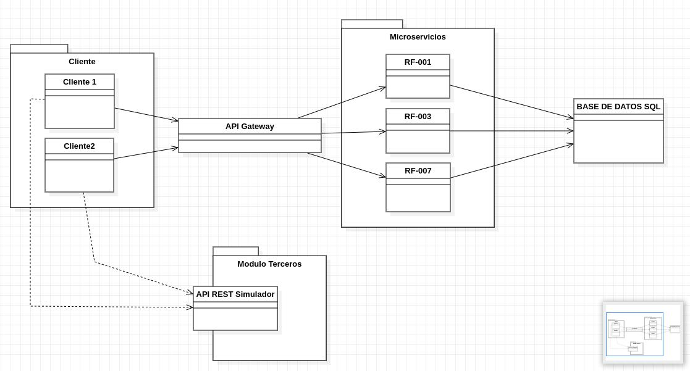
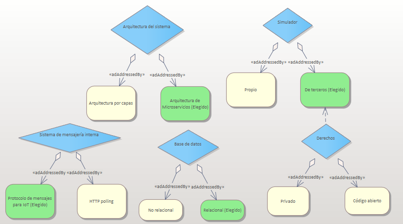

# [ADD-0001 Arquitectura-del-sistema]

* Status: [acepted]
* Deciders: [Daniel Gallardo, Sergio Pérez]
* Date: [2022-11-02]

## Contexto y problemas a resolver

[Necesitamos diseñar un estructura para organizar el planteamiento del sistema requerido.]

## Requisitio de decisión

* [RF-011](../requisitos/RF-011.md)

## Opciones consideradas

* [Arquitectura de Microservicios](https://docs.microsoft.com/es-es/azure/architecture/guide/architecture-styles/microservices) : " La arquitectura de microservicios es un método de desarrollo de software que consiste en construir una aplicación como un conjunto de pequeños servicios, con operaciones bien definidas e independientes entre sí."
* [Arquitectura de capas](https://docs.microsoft.com/es-es/azure/architecture/guide/architecture-styles/n-tier) : "La arquitectura en capas consta en dividir la aplicación en capas, con la intención de que cada capa tenga un rol muy definido."

## Decisiones tomadas

Opción elegida: "[Arquitectura de Microservicios]" porque es el sistema que quiere el cliente expresamente para mejorar la flexibilidad y escalabilidad.

### Consecuencias positivas <!-- optional -->

* [Mejoras en la flexibilidad.]
* [Mejoras en la escalabilidad.]
* [Menos problemas para el cliente.]
* [Código y mantenimiento más legible.]
* [Facilidad a la hora de aplicar una implementación continua.]
* [Es el que ha solicitado el cliente.]

### Consecuencias negativas <!-- optional -->

* [Posible dificultad a la hora de migrar el sistema.]
* [Tener verificado en la base de datos todos los microservicios del sistema para un mayor control]

## Pros y Contras de las Opciones

### [Arquitectura de microservicios]

* Bueno, porque [es la arquitectura que ha solicitado el cliente]
* Bueno, porque [los microservicios son más fáciles de mantener y testear, puesto que son servicios pequeños que hacen una sóla cosa, pero la hacen bien]
* Bueno, ya que [al no estar integrados en el sistema principal, son de fácil despliegue]
* Bueno, ya que [pueden tener una escalabilidad independiente y es más sencillo aislar fallos a un microservicio concreto, en vez de una sección o funcionalidad de la aplicación]
* Malo, porque [hay que lidiar con la complejidad adicional de los sistemas distribuidos]
* Malo, porque [hay que implementar dependencias de un servicio a otro, comunicación interna entre servicios, etc.]
* Malo, porque [implica un mayor consumo de recursos, puesto que cada microservicio tiene su propio SO y dependencias]

### [Arquitectura por capas]

* Bueno, porque [existe una jerarquía bien marcada entre elementos]
* Malo, porque [ciertos elementos se quedarian fuera de esta jerarquía]
* Malo, porque [no existe una escalabilidad independiente]

## UML de la decisión

