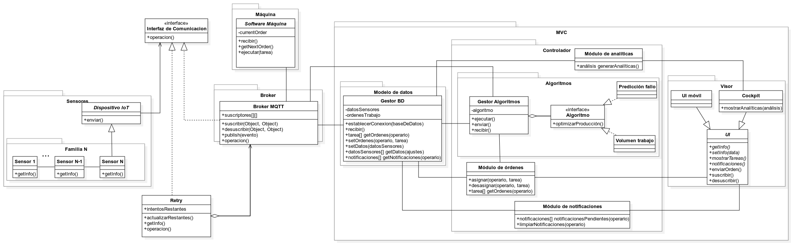

# ADD-0001 Arquitectura del sistema

* Date: 2022-11-22

## Contexto y problemas a resolver

Necesitamos diseñar un estructura para organizar el planteamiento del sistema requerido.

## Requisitio de decisión

* [RF-001](../requisitos/RF-001.md)

## Opciones consideradas

* [Message driven](./0001.1-Message-Driven.md): "Un Message-Driven Bean o MDB (EJB dirigido por mensajes) es un oyente de mensajes que puede consumir mensajes de una cola o de una durable subscription. Dichos mensajes pueden ser enviados por cualquier componente JavaEE (cliente, otro EJB o una componente Web como un servlet)."
* [Arquitectura de Microservicios](./0001.2-Microservicios.md): " La arquitectura de microservicios es un método de desarrollo de software que consiste en construir una aplicación como un conjunto de pequeños servicios, con operaciones bien definidas e independientes entre sí."
* [Event driven](./0001.3-Event-Driven.md): "Es un patrón de arquitectura software que promueve la producción, detección, consumo de, y reacción a eventos. Un evento puede ser definido como "un cambio significativo en un estado."

## Decisiones tomadas

Opción elegida: "Event driven", porque es el sistema que más se adapta a los requerimientos ofrecidos por el cliente.

### Consecuencias positivas <!-- optional -->

* Mejoras en la flexibilidad.
* Mejoras en la comunicación.
* Menos problemas para el cliente.
* Código y mantenimiento más legible.
* Facilidad a la hora de aplicar una implementación continua.

### Consecuencias negativas <!-- optional -->

* Posible dificultad a la hora de migrar el sistema.
* Tardanza en detectar fallos de sincronización

### Opciones Relacionadas

* [Message driven](./0001.1-Message-Driven.md)
* [Arquitectura de Microservicios](./0001.2-Microservicios.md)
* [Event driven](./0001.3-Event-Driven.md)

## UML de la decisión

