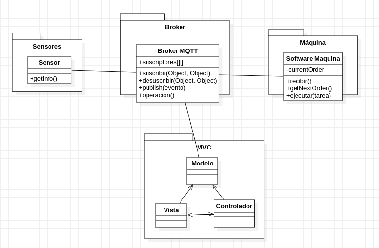

# ADD-0002 Sistema de mensajería interna

* Date: 2022-11-22

## Contexto y problemas a resolver

Los operarios de la factoria 4.0 deben estar permanentemente notificados a través de un sistema de mensajería interno y deben poderse suscribir a diferentes eventos y notificaciones como actualizaciones de la producción, fallos en los sensores o sobrecarga en la producción. Los operarios también deben poder enviar órdenes de trabajo a las máquinas que van a fabricar cada componente.

## Requisitio de decisión

* [RF-006](../requisitos/RF-006.md)
* [RF-009](../requisitos/RF-009.md)

## Opciones consideradas

* [Broker MQTT](./0002.1-Broker-Comunicacion-MQTT.md): "Uso de un gestor de eventos basado en el protocolo MQTT, que está especializado para ser usado con los dispositivos IoT"
* [Broker HTTP](./0002.2-Broker-Comunicaci%C3%B3n-HTTP.md): "Gestor de eventos basado en el protocolo HTTP que se encarga de comunicar los sensores con la lógica de nuestra aplicación"

## Decisiones tomadas

Opción elegida: "Broker MQTT" porque es un protocolo pensado especialmente para los sistemas que usan dispositivos IoT, por lo que se va a adaptar mejor al sistema que tenemos que desarrollar. También permite enviar mensajes a las distintas máquinas, por lo que realmente nos está proporcionando un bus asíncrono para que se comuniquen los distintos componentes de nuestra fábrica. A su vez, debemos tener en cuenta que proporciona un buen soporte para un elevado flujo de datos, lo que es completamente necesario en sistemas que usan dispostivos IoT.

### Consecuencias positivas <!-- optional -->

* Mejor mánejo de grandes flujos de datos, muy habituales en los sistemas que trabajan con dispositivos IoT.
* Posibilidad de que los componentes del sistema intercambien información los unos con los otros, lo que reduce la complejidad asociada habituálmente a este tipo de protocolos.
* Conexión muy estable entre la comunicación de los distintos componentes de nuestro sistema.
* Utilización de un protocolo Publish/Subscribe, lo que se adapta completamente a nuestro sistema y permite reducir los costos que produce un protocolo basado en el polling.
* La llegada de datos está asegurada, por lo que en situaciones críticas, todos los datos que sean enviados, serán recibidos, lo que nos permite actuar con la mayor brevedad posible.

### Consecuencias negativas <!-- optional -->

* Uso de un protocolo menos conocido.

### Opciones Relacionadas

* [Broker MQTT](./0002.1-Broker-Comunicacion-MQTT.md)
* [Broker HTTP](./0002.2-Broker-Comunicacion-HTTP.md)

## UML de la decisión

