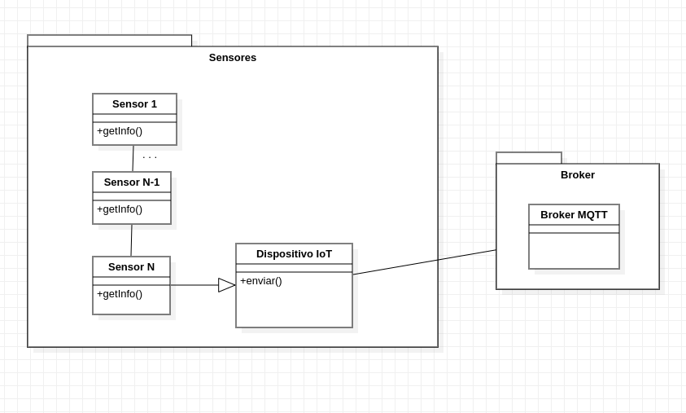

# ADD-0003 Familia de dispositivos con 3 sensores

* Date: 2022-11-22

## Contexto y problemas a resolver

Los dispositivos de esta familia estan compuestos por tres sensores en los que el primero envía información al segundo y este al tercero que finalmente lo envía al centro de notificaciones. Se busca utilizar un patrón de diseño ya creado capaz de resolver esto o diseñar un estilo propio.

## Requisitio de decisión

* [RF-007](../requisitos/RF-007.md)

## Opciones consideradas

* [Patrón Chain Of Responsability](./0003.1-Chain-of-Responsability.md): "Patrón de diseño de comportamiento que te permite pasar solicitudes a lo largo de una cadena de manejadores, en este caso, los sensores"
* [Patrón propio](./0003.2-Patron-Propio.md): "Diseñar el sistema sin tener en cuenta ningún patrón de diseño y hacerlo mediante clases de sensores"

## Decisiones tomadas

Opción elegida: "Patrón Chain Of Responsability" porque este patrón permite liberar a un objeto de tener que saber qué otro objeto maneja una petición, permite que ni el receptor ni el emisor se conozcan ni estos conozcan la estructura de la cadena de objetos. A parte, añade flexibilidad, podemos añadir o cambiar responsabilidades a objetos a la hora de tratar una petición, es decir, en tiempo de ejecución.

### Consecuencias positivas <!-- optional -->

* Reducción de acoplamiento
* Flexibilidad a la hora de asignar responsabilidades a los objetos

### Consecuencias negativas <!-- optional -->

* No garantiza la recepción, no hay receptor explícito

### Opciones Relacionadas

* [Patrón Chain Of Responsability](./0003.1-Chain-of-Responsability.md)
* [Patrón propio](./0003.2-Patron-Propio.md)

## UML de la decisión

