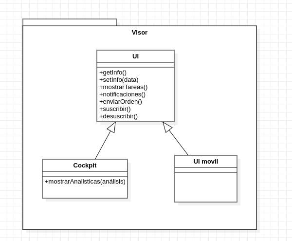

# ADD-0004 Arquitectura Secundaria para los componentes de visualización

* Date: 2022-11-22

## Contexto y problemas a resolver

Necesitamos que el sistema disponga de un centro de notificaciones, el cuál permita gestionar todas las funcionalidades del sistema. También necesitamos una aplicación móvil para que los operadores puedan enviar órdenes de trabajo y recibir notificaciones e informes de los eventos a los que están suscritos.

## Requisitos de decisión

* [RF-004](../requisitos/RF-004.md)
* [RF-008](../requisitos/RF-008.md)

## Opciones consideradas

* [Modelo Vista Controlador](./0004.1-Modelo-Vista-Controlador.md): "El modelo vista controlador es un estilo arquitectónico que nos permite tener múltiples vistas de los mismos datos."
* [Cliente Servidor](./0004.2-Cliente-Servidor.md): "La arquitectura cliente servidor, se basa en un servidor, al que se pueden conectar múltiples clientes para solicitar los datos que necesitan."

## Decisiones tomadas

Opción elegida: "Modelo Visto Controlador" por que permite crear múltiples clientes para visualizar los datos de nuestro sistema, sin la necesidad de aumentar la complejidad de la lógica interna.

### Consecuencias positivas <!-- optional -->

* Separación entre la interfaz de usuario y la lógica de programa.
* Los componentes son reutilizables.
* Posibilidad de múltiples interfaces de usuario sin complicar la lógica interna del programa.

### Consecuencias negativas <!-- optional -->

* Posible dificultad a la hora de diseñar el sistema.

### Opciones Relacionadas

* [Modelo Vista Controlador](./0004.1-Modelo-Vista-Controlador.md)
* [Cliente Servidor](./0004.2-Cliente-Servidor.md)

## UML de la decisión

