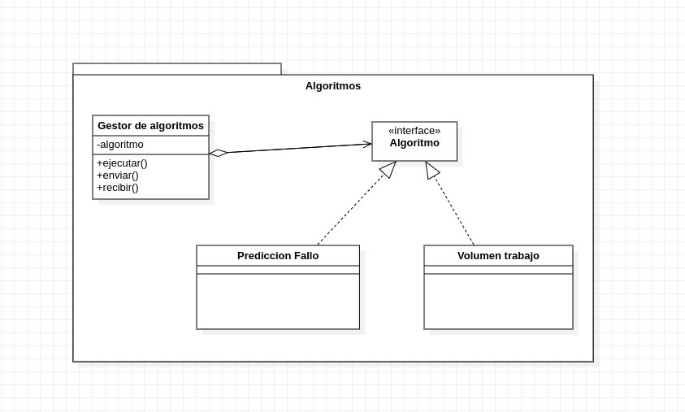

# ADD-0005.1 Strategy

* Date: 2022-11-15

## Contexto y problemas a resolver

* Se requiere organizar los algoritmos para que dependiendo de la situacion, se eliga que algoritmo utilizar en cada momento.

## Requisitio de decisión

* [RF-010](../requisitos/RF-010.md)
* [RF-011](../requisitos/RF-011.md)

## Opciones consideradas

* [Strategy](./0005.1-Strategy.md): " Strategy es un patrón de diseño de comportamiento que te permite definir una familia de algoritmos, colocar cada uno de ellos en una clase separada y hacer sus objetos intercambiables"

* [Chain_of_Responsibility](./0005.2-Chain-of-Responsability-Algoritmos.md): " Es un patrón de diseño de comportamiento que te permite pasar solicitudes a lo largo de una cadena de manejadores"

## Decisiones tomadas

Opción elegida: "Strategy" porque cubre lo solicitado por la documentacion. Lo que se pide no es una comunicacion si no elegir dependiendo de la ocasión.

### Consecuencias positivas <!-- optional -->

* Te permite alternar.
* Es un patron de diseño y esta testeado.
* No se pierden recursos.

### Consecuencias negativas <!-- optional -->

* No se intercambia informacion entre los algoritmos.

### Opciones Relacionadas

* [Strategy](./0005.1-Strategy.md):
* [Chain_of_Responsibility](./0005.2-Chain-of-Responsability-Algoritmos.md)

## UML de la decisión

